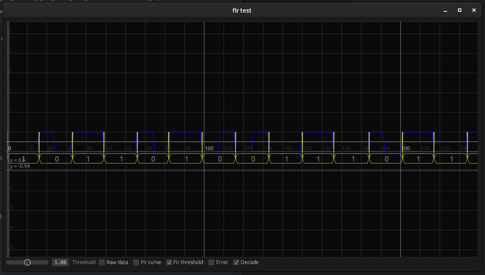

# Sanic
~~The probably slowest lighthouse 2.0 data decoder out there, made fast by your cpu™~~
This project has been totally f**ked by me the past hours into something completely else, but it was a lot of fun.

Data provided by cnlohr in [this issue](https://github.com/cnlohr/esptracker/issues/1)

[Get Data directly](https://drive.google.com/drive/folders/1iN0vuhsRMY6tCWZOCC9F4SSBbT9ljmq7?usp=sharing)

I am using `8_seconds_8_bit_fixed_Data_20180805134454.8.dat.gz`, extract it into `data/data.dat`.

This is my first adventure into this kind of programming and generally data visualisation, so don't expect the best of this software

## General information
- GUI: egui
- Rust version: 1.58 (should work with a lower version all good, but I haven't tested that yet)
- CPU usage: to much

The application reads each bytes of the providede file but only makes the first bit of it count, so `byte & 1` for each sample

## Screenshot of the software

## TODOs:
- The FIR algorithm is probably sub optimal for what I am doing, find better values
- Actually cache the cache the data computed and not recompute (multible times) per frame
